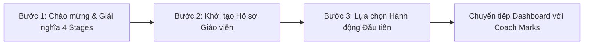

# A5 – User Guidelines & Onboarding Framework

> **Hệ thống**: Teacher Competency Growth OS (Dolphins21) | 2026-08-27
>
> **Triết lý**: Hướng dẫn người dùng không chỉ dừng ở việc "chỉ chỗ bấm nút", mà phải là trợ lý đồng hành giúp giáo viên hiểu rõ triết lý phát triển năng lực (4 Stages), tự tin thao tác, và duy trì thói quen học tập liên tục (Assess → Plan → Act → Reflect).

---

## 1. QUY CHUẨN ONBOARDING FLOW

Quy trình chào đón và kích hoạt giáo viên mới gồm 3 giai đoạn tinh gọn, không làm quá tải thông tin:

### 1.1 Chi tiết 4 Cấp độ Năng lực (4 Stages Understanding)
Trong bước đầu tiên, hệ thống cung cấp góc nhìn trực quan và dễ hiểu nhất về 4 cấp độ:

| Cấp độ | Tên gọi (Stage) | Ý nghĩa cốt lõi | Dấu hiệu hành vi điển hình |
| :--- | :--- | :--- | :--- |
| **Stage 1** | **Novice** (Bắt đầu) | Đang làm quen, bước đầu tiếp cận | Thực hiện khi có chỉ đạo, quy trình mẫu; chưa thường xuyên. |
| **Stage 2** | **Developing** (Đang phát triển) | Thực hiện khá đều đặn, tích cực thử nghiệm | Tự thực hiện được phần lớn nhưng vẫn cần hỗ trợ, phản hồi hoặc điều chỉnh. |
| **Stage 3** | **Proficient** (Thành thạo) | Tự chủ, linh hoạt và nhất quán | Chủ động thu thập dữ liệu học sinh, áp dụng chiến lược dạy học linh hoạt. |
| **Stage 4** | **Mentor / Expert** (Chuyên gia / Dẫn dắt) | Kiểu mẫu, lan tỏa và cải tiến hệ thống | Dẫn dắt đồng nghiệp, đóng góp vào khung chuyên môn và cải tiến tổ chức. |

### 1.2 Form Thông tin Hồ sơ (Profile Setup)
Chỉ thu thập các trường thông tin thiết yếu phục vụ cá nhân hóa lộ trình:
- **Họ và tên**: Định danh hiển thị.
- **Môn giảng dạy / Lĩnh vực**: Xác định ngữ cảnh chuyên môn.
- **Số năm kinh nghiệm**: Hỗ trợ phân tích tiến độ phù hợp.
- **Trường học / Tổ chức**: Đơn vị công tác.

---

## 2. IN-CONTEXT MICRO-GUIDANCE (HƯỚNG DẪN THEO NGỮ CẢNH)

Hướng dẫn xuất hiện đúng lúc, đúng chỗ khi người dùng đang thực hiện tác vụ, giảm thiểu ma sát nhận thức.

### 2.1 Tooltips & Info Icons (Biểu tượng Giải thích Chuẩn 2 Tầng)
- **Hình thức hiển thị Icon**:
  - Icon hình tròn viền cam `border: 1.5px solid var(--primary)` với dấu hỏi `?` thanh mảnh, nền trong suốt (hoặc nền trắng), đổi nền cam chữ trắng khi hover.
- **Cấu trúc Tooltip Card (2 Tầng chuẩn conan1.com)**:
  - **Khung hộp**: Nền trắng `#ffffff`, viền nhẹ `1px solid var(--border)` hoặc đổ bóng nổi bật `box-shadow: 0 10px 25px -5px rgba(0, 0, 0, 0.1), 0 8px 10px -6px rgba(0, 0, 0, 0.1)`, bo góc `border-radius: 12px`, padding `16px 18px`, chiều rộng cố định `280px - 320px`.
  - **Tầng 1 (Định nghĩa & Mô tả tính năng)**:
    - **Header**: Dấu chấm tròn màu cam `--primary` (`●`) + Tên tính năng viết hoa in đậm (`font-size: 13px; font-weight: 800; color: var(--foreground); letter-spacing: 0.05em`).
    - **Mô tả ngắn**: Giải thích ngắn gọn tính năng làm gì (`font-size: 13px; color: var(--muted-foreground); line-height: 1.5; margin-top: 6px;`).
  - **Đường phân cách**: `border-top: 1px solid #f1f5f9; margin: 12px 0;`
  - **Tầng 2 (Giá trị hành động - "TRANG NÀY / TÍNH NĂNG NÀY GIÚP GÌ CHO TÔI?")**:
    - **Eyebrow Header**: Màu cam `--primary` in đậm (`font-size: 12px; font-weight: 800; color: var(--primary); text-transform: uppercase; letter-spacing: 0.05em;`).
    - **Giá trị cốt lõi**: Giải thích lý do vì sao giáo viên cần dùng và kết quả đạt được (`font-size: 13px; color: var(--foreground); line-height: 1.5; margin-top: 6px;`).
- **Vị trí áp dụng**:
  - Tiêu đề các mục thống kê trên Dashboard (`Tiến độ`, `Điểm TB`, `Streak`).
  - Tiêu đề Biểu đồ `Radar Chart`, `Focus`, `Goals`, `Evidence Vault`.
  - Các trường form thiết lập quan trọng trên Onboarding.

### 2.2 Hotspots & Pulsing Beacons (Điểm nhấn Thu hút)
- **Cơ chế**: Vòng tròn nhỏ phát sáng nhấp nháy (pulsing animation) màu cam `--primary` (`#cc4e2d`) nằm trên các tính năng quan trọng chưa từng được tương tác.
- **Nguyên tắc**:
  - Tự động biến mất vĩnh viễn sau khi người dùng bấm vào xem lần đầu.
  - Mỗi màn hình không xuất hiện quá 2 Hotspots cùng một lúc để tránh phân tâm.
- **Vị trí áp dụng**:
  - Nút **"Đánh Giá Nhanh"** (Quick Assess) tại Dashboard khi chưa có bản đánh giá nào.
  - Tab **"Bằng Chứng Thực Tế"** (Evidence Vault) sau khi hoàn thành đánh giá.
  - Tính năng lọc theo Trụ cột năng lực mới thêm.

### 2.3 Coach Marks & Feature Walkthrough (Spotlight từng bước)
- **Cơ chế**: Làm tối nhẹ lớp nền màn hình (dim overlay), làm nổi bật (spotlight) một khu vực giao diện cụ thể kèm hộp thoại chỉ dẫn với nút "Tiếp tục" / "Bỏ qua".
- **Nguyên tắc**:
  - Giới hạn tối đa 3-4 bước cho một walkthrough.
  - Có thanh tiến trình (ví dụ: Bước 1/3) và nút tắt rõ ràng.
  - Luôn ghi nhớ trạng thái đã xem (lưu vào profile / localStorage) để không lặp lại gây phiền phức.
- **Vị trí áp dụng**:
  - Lần đầu tiên truy cập **Màn hình Đánh giá Toàn diện** (`/assess/full`).
  - Lần đầu xem **Biểu Đồ Năng Lực & Phân tích Đột phá** (`/dashboard/growth`).

---

## 3. EMBEDDED & PASSIVE GUIDES (HƯỚNG DẪN NHÚNG TRỰC TIẾP)

Hướng dẫn tích hợp tự nhiên vào cấu trúc giao diện mà không cần người dùng phải bấm kích hoạt.

### 3.1 Empty States (Trạng thái Trống có Động lực)
- **Cơ chế**: Khi một trang hoặc danh sách chưa có dữ liệu (ví dụ: chưa có mục tiêu, chưa có bằng chứng), tuyệt đối không để màn hình trắng hoặc chỉ thông báo "Không có dữ liệu".
- **Cấu trúc chuẩn**:
  1. **Hình minh họa / Icon trực quan**: Thể hiện tính năng (minh họa nhẹ nhàng, sạch sẽ).
  2. **Tiêu đề truyền cảm hứng**: Nêu bật giá trị (ví dụ: *"Bắt đầu lưu giữ những cột mốc giảng dạy của bạn"*).
  3. **Mô tả ngắn gọn (1-2 câu)**: Giải thích tính năng này giúp gì cho giáo viên.
  4. **Nút Hành động Chính (Action CTA)**: Bắt đầu bằng động từ mạnh (ví dụ: `+ Thêm Bằng Chứng Đầu Tiên`, `Thiết Lập Mục Tiêu Mới`).

### 3.2 Placeholder & Helper Text (Gợi ý Nhập liệu Trực quan)
- **Placeholder**:
  - Cung cấp ví dụ thực tế cụ thể, không dùng các từ chung chung như "Nhập vào đây...".
  - *Ví dụ tốt*: `Ví dụ: Dữ liệu khảo sát mức độ hiểu bài cuối tiết học môn Toán 9`.
  - *Ví dụ xấu*: `Nhập ghi chú...`.
- **Helper Text**:
  - Đặt ngay dưới ô nhập liệu với kích thước chữ nhỏ hơn và màu muted (`var(--muted-foreground)`).
  - Hướng dẫn định dạng hoặc tiêu chuẩn nội dung cần điền.

### 3.3 Interactive Templates & Sample Data (Dữ liệu Mẫu Thao tác Thử)
- **Cơ chế**: Cung cấp tùy chọn "Tải dữ liệu mẫu" (Load Sample Data) hoặc nút "Xem hồ sơ mẫu của Giáo viên Mentor" để người mới có thể khám phá toàn bộ sức mạnh của hệ thống trước khi tự điền.
- **Nguyên tắc**:
  - Hiển thị banner thông báo rõ ràng khi đang xem dữ liệu mẫu.
  - Có 1 nút duy nhất để chuyển đổi sang "Dữ liệu thật của tôi".

---

## 4. CHECKLIST TIÊU CHUẨN KIỂM DUYỆT (QC GUIDELINE COMPLIANCE)

Mọi màn hình được triển khai phải vượt qua bộ câu hỏi sau:
1. Có phần tử nào gây khó hiểu mà **chưa có Tooltip / Info Icon** không?
2. Khi chưa có dữ liệu, **Empty State có hướng dẫn và nút bấm CTA** rõ ràng không?
3. Các trường nhập liệu có **Helper Text / Placeholder mẫu thực tế** không?
4. Người dùng mới có thể hiểu được **ý nghĩa của 4 Stages** ngay trong 60 giây đầu tiên không?
